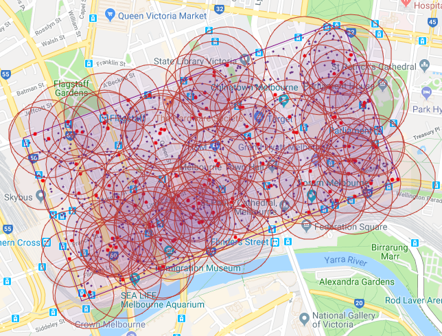

# EUA Datasets

This repository maintains a set of EUA datasets which we collected from real-world data sources. The datasets are publicly released 
to facilitate research in Edge Computing. Feel free to contact us if you have any comments or questions. 
We would love to hear from you on ideas to improve the datasets.

All the data is in Australia region.

- _edge-servers_ folder: contains datasets of edge server locations.
- _users_ folder: contains datasets of user location.

Below is an example of edge servers with their coverages and end-users.

_(The map was generated by Python and Google Maps API.)_

**Acknowledgements**
- [The Australian Communications and Media Authority](https://www.acma.gov.au/Industry/Spectrum/Radiocomms-licensing/Register-of-radiocommunications-licences/radiocomms-licence-data) for the radio base station dataset.
- [IP-API](http://ip-api.com/) for use to convert IP addresses to geographical locations.

**Dataset Citation**

If you have used the EUA repository, we would appreciate citations to the following paper:

- [Lai et al. 2018] Phu Lai, Qiang He, Mohamed Abdelrazek, Feifei Chen, John Hosking, John Grundy, and Yun Yang, Optimal Edge User Allocation in Edge Computing with Variable Sized Vector Bin Packing, 16th International Conference on Service-Oriented Computing (ICSOC2018), pp. 230-245, Hangzhou, China, 2018.

**Publications**

The below publications use our EUA repository:

1. Phu Lai, Qiang He, Guangming Cui, Xiaoyu Xia, Mohamed Abdelrazek, Feifei Chen, John Hosking, John Grundy, Yun Yang, QoE-aware User Allocation in Edge Computing Systems with Dynamic QoS, Future Generation Computer Systems (FGCS), accepted in June 2020.

16.	Phu Lai, Qiang He, John Grundy, Feifei Chen, Mohamed Abdelrazek, John Hosking, Yun Yang, Cost-Effective App User Allocation in an Edge Computing Environment, IEEE Transactions on Cloud Computing (TCC), accepted in June, 2020.

15.	Guangming Cui, Qiang He, Xiaoyu Xia, Phu Lai, Feifei Chen, Tao Gu, Yun Yang, Interference-aware SaaS User Allocation Game for Edge Computing, IEEE Transactions on Cloud Computing (TCC), accepted in June, 2020.

14. Zhiwei Xu, Guobing Zou, Xiaoyu Xia, Ya Liu, Yanglan Gan, Bofeng Zhang, Qiang He, Distance-aware Edge User Allocation with QoE Optimization, 27th IEEE International on Web Services (ICWS2020), Beijing, China, 2020. 

13. Xiaoyu Xia, Feifei Chen, Guangming Cui, Mohamed Abdelrazek, John Grundy, Hai Jin, Qiang He, Budgeted Data Caching based on k-Median in Mobile Edge Computing, 27th IEEE International on Web Services (ICWS2020), Beijing, China, 2020.

12. Ying Liu, Ao Zhang, Xiaoyu Xia, Feifei Chen, Bin Zhang and Qiang He, Proactive Data Cache and Replacement in the Edge Computing Environment, 13th IEEE Conference on Cloud Computing (CLOUD2020), Beijing, China, 2020.

11. Feifei Chen, Jingwen Zhou, Xiaoyu Xia, Hai Jin and Qiang He, Optimal Application Deployment in Mobile Edge Computing Environment, 13th IEEE Conference on Cloud Computing (CLOUD2020), Beijing, China, 2020.

10. Phu Lai, Qiang He, Guangming Cui, Feifei Chen, Mohamed Abdelrazek, John Grundy, John Hosking and Yun Yang, Quality of Experience-Aware User Allocation in Edge Computing Systems: A Potential Game, 40th IEEE International Conference on Distributed Computing Systems (ICDCS2020), Singapore, 2020.

9. Guangming Cui, Qiang He, Xiaoyu Xia, Feifei Chen, Hai Jin and Yun Yang, Robustness-oriented k Edge Server Placement, 20th IEEE/ACM International Symposium on Cluster, Cloud and Internet Computing (CCGrid2020), Melbourne, Australia, 2020.

8. Qiang He, Guangming Cui, Xuyun Zhang, Feifei Chen, Shuiguang Deng, Hai Jin, Yun Yang, A Game-Theoretical Approach for User Allocation in Edge Computing Environment, IEEE Transactions on Parallel and Distributed Systems (TPDS), accepted in August 2019.

7. Phu Lai, Qiang He, Guangming Cui, Xiaoyu Xia, Mohamed Abdelrazek, Feifei Chen, John Hosking, John Grundy, and Yun Yang, Edge User Allocation with Dynamic Quality of Service, 17th International Conference on Service-Oriented Computing (ICSOC2019), Toulouse, France, 2019. 

6. Xiaoyu Xia, Feifei Chen, Qiang He, Guangming Cui, Phu Lai, Mohamed Abdelrazek, John Grundy, and Hai Jin, Graph-based Optimal Data Caching in Edge Computing, 17th International Conference on Service-Oriented Computing (ICSOC2019), Toulouse, France, 2019.

5. Qinglan Peng, Yunni Xia, Zeng Feng, Jia Lee, Chunrong Wu, Xin Luo, Wanbo Zheng, Hui Liu, Yidan Qin, Peng Chen, Mobility-Aware and Migration-Enabled Online Edge User Allocation in Mobile Edge Computing, 26th IEEE International Conference on Web Services (ICWS2019, CORE/ERA A), Milan, Italy, 2019.

4. Hailiang Zhao, Cheng Zhang, Wei Du, Qiang He and Shuiguang Deng, A Mobility-Aware Cross-edge Computation Offloading Framework for Partitionable Applications, 26th IEEE International Conference on Web Services (ICWS2019), Milan, Italy, 2019.

3. Wei Du, Qiwang Lei, Qiang He, Wei Liu, Feifei Chen, Lei Pan, Tao Lei and Hailiang Zhao, Multiple Energy Harvesting Devices Enabled Joint Computation Offloading and Dynamic Resource Allocation for Mobile-Edge Computing Systems, 26th IEEE International Conference on Web Services (ICWS2019), Milan, Italy, 2019.

2. Ying Liu, Qiang He, Dequan Zheng and Bin Zhang, Data Caching Optimization in the Edge Computing Environment, 26th IEEE International Conference on Web Services (ICWS2019, CORE/ERA A), Milan, Italy, 2019.

1. Phu Lai, Qiang He, Mohamed Abdelrazek, Feifei Chen, John Hosking, John Grundy, and Yun Yang, Optimal Edge User Allocation in Edge Computing with Variable Sized Vector Bin Packing, 16th International Conference on Service-Oriented Computing (ICSOC2018, CORE/ERA A), pp. 230-245, Hangzhou, China, 2018.
